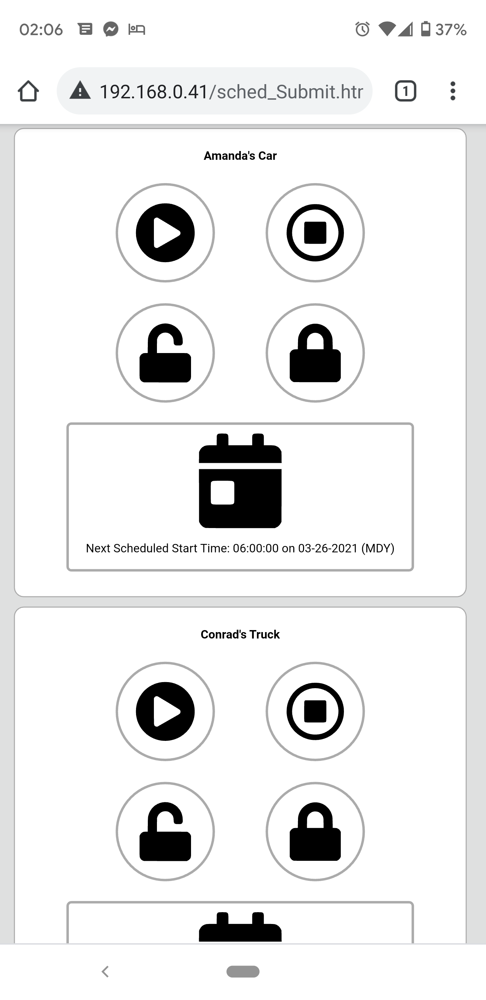

# ESP_Remote_Start

<h2>Motivation & Abstract</h2>

 Chevy wanted $15/month to be able to start/lock/unlock/find my wife's new car with an app. This is silly but pretty useful. Is it worth $15/month? No, no it's not.

 What I have done is developed a website that is hosted on an ESP8266. Through this website a user can start, stop, lock, and unlock their vehicle. The website is also capable of scheduling remote-start times. This is great in the winter when you don't think about starting your vehicle until you walk out. Snow in the forecast tonight? Schedule a remote start 10 minutes before you leave from work to help the scraping process. The extra idle-time is nice for getting the lubricant's moving again after sitting all night.

<h2>Warnings</h2>

 First thing's first: Please don't even consider building one of these if you park your cars in a garage. A single error in the code could kill you and the code is not without it's flaws! Second, I implement OTA updating, this is in no way locked down to prevent some rando with a laptop in your neighborhood from pushing nefarious code onto the device.
 

 With that said, if you park your vehicles outside, and are willing to accept the risk of someone remote starting it/unlocking it to steal your stuff then by all means continue on. 

<h2>Limitations</h2>

 I did a pretty good job making a minimum-viable-product (prototype) with the code. However there are several limitations. 
  
1) You can only use this service on a local network. You'll need to open it up to the internet to have access to stuff when you're away from your home. Please don't do this.
2) This only works while your vehicles are in range of the key-fob. 
3) I do a shoddy job converting from Month-day-year-hour-minute-second to Epoch time. It works, but, I'm not quite sure how. 
4) Currently this code only supports up to 2 vehicles, Amanda's (AF) and Conrad's (CF). The hardware on the Wemos could support up to 3 vehicles. 

<h2>How to use this</h2>

1) Get a Wemos ESP8266 unit. 
2) Upload the entire sketchbook onto the unit (after entering in your SSID/Password). 
3) Download the ESP8266 Sketch Data Upload tool
4) Upload the HTML, CSS, Icons, etc from the Data folder onto your ESP8266. 
5) Connect to http://cars.local to access the website. 
6) Reverse engineer your key-fobs. 
7) ????
8) Profit.

<h2>Reverse Engineering</h2>

This is pretty easy, 3.3V (from your ESP) connects to + on the fob and Gnd connects to -. Okay now what about the buttons? With my sample size of two, the microcontroller embedded in the key fobs uses a pull-up topology. Follow the traces on the fob to determine which ones are connected to the microcontroller and which ones are ground connections. From here, you can solder wires from the ESP GPIO pins to the pads feeding into the microcontroller.

<h3>Disclaimer</h3>

 This project is a proof of concept. It is by no means a finished product and should not be treated as such. This is here to help you help me get my foot in the door with HTML/CSS/AJAX and interfacing an ESP8266 with a real-world device. Please use common sense 
 
